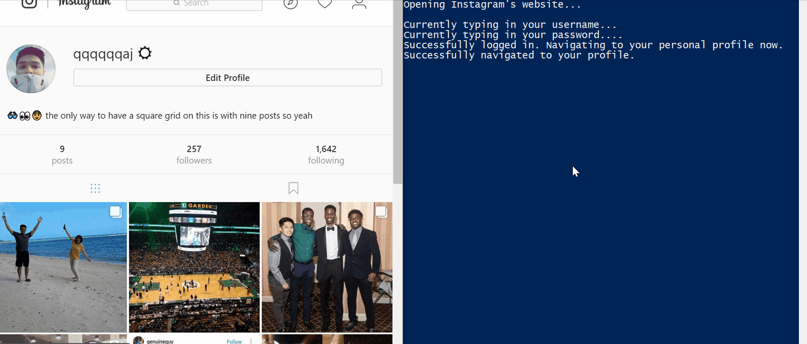

## Background

There comes a point when the amount of users an individual is following on Instagram gets out of hand. Some meaningful posts might get lost in the shuffle due to the sheer volume of posts originating from all of the people on one's following list. Also, as time goes on, people change, and our interests change, too. Some accounts we follow may no longer pique our interest for one reason or another.

This automation script assists in regaining control of your Instagram Feed by unfollowing every user you are currently following. Afterwards, a text file (`List_Of_Usernames.txt`) containing all of the usernames unfollowed is created within the same directory the script was executed in. Whoever runs this script can then open that text file in Notepad, Microsoft Word, Atom, etc. and use that information as a starting point to re-follow certain accounts.

As a heads-up, Instagram sets limitations on the amount of people you can follow and unfollow during an undisclosed period of time. Experiences with this particular script may vary depending upon a multitude of factors. In light of this, I am considering making adjustments to the source code in order to unfollow only 200 people per run-through. Feel free to adjust this as you see fit.

## The Situation


## Expected Output I



## Expected Output II


## Dependencies

***If anything is unclear regarding environment setup, navigating directories, or explanations for automation, feel free to check out my YahooFantasyBasketballScript repository which could be helpful***

- **Ruby**: 2.3.3
  - Enter the command `ruby -v` in your terminal to determine which version you may have
- **Watir**: 6.8.4
  - Enter the command `gem list` in your terminal to determine which version you may have
- **Highline**: 1.7.8
  - Enter the command `gem list` in your terminal to determine which version you may have
- **Google Chrome**: 62 (Official Build) (64-bit)
  - Enter `chrome://settings/help` in your search bar to determine which version you may have
- **Google's ChromeDriver**:
  - Check out the YouTube videos by DevNami or Artur Spirin for ChromeDriver installation
  - Also feel free to check out the "[Getting Started](https://sites.google.com/a/chromium.org/chromedriver/getting-started)" section of Google's ChromeDriver support page

## Implementation

1. Clone, download, or fork this repository to your computer
2. Ensure that ChromeDriver is properly placed in your PATH
3. Once in the proper directory/folder, enter the command `bundle install` in your terminal, command line, or shell
4. Execute the file by entering `ruby 'Unfollow_Everyone.rb'`

## Prompts

Preview of Prompt:

```
Enter your Instagram username:
Enter your password:
Confirm your password:
```

Example of a Valid Prompt Submission:

```
Enter your Instagram username: computer1234321
Enter your password: ********
Confirm your password: ********
```
